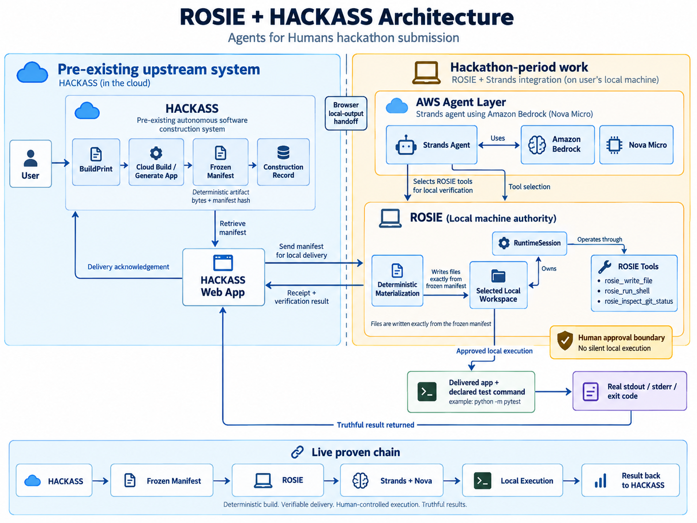

# ROSIE

ROSIE is a local-machine execution and verification runtime for agentic software work.

For the **AWS Agents for Humans Hackathon**, ROSIE is the newly built agent-side locality layer that receives delivered software, preserves the human approval boundary, and lets **Strands Agents** choose and invoke real ROSIE capabilities on the user's machine.

## What ROSIE does

ROSIE gives an agent a bounded local workspace with explicit tools for:

- file and directory inspection;
- controlled file changes;
- Git inspection;
- shell execution;
- approval-gated mutating actions;
- workspace-scoped runtime ownership; and
- post-delivery verification.

The current hackathon integration proves this live chain:

```text
HACKASS
  ↓
BuildPrint / declared verification command
  ↓
deterministic build delivery
  ↓
ROSIE on the local machine
  ↓
Amazon Strands Agents
  ↓
Amazon Nova Micro
  ↓
ROSIE tools / approval boundary
  ↓
real local execution and test results
  ↓
result returned to HACKASS
```

The delivered artifact bytes remain authoritative. Strands does not rewrite the delivered program. It performs post-delivery local verification and execution through ROSIE.

## Hackathon provenance

This submission distinguishes new work from pre-existing work.

- **ROSIE** and the Strands-powered local execution/verification path were built during the Agents for Humans submission window.
- **HACKASS** is a pre-existing upstream software-construction system used to produce and deliver the software that ROSIE verifies locally.
- HACKASS is disclosed as pre-existing work; the hackathon contribution is the ROSIE + Strands local-agent path and its integration with delivered builds.

See [docs/HACKATHON.md](docs/HACKATHON.md) for the detailed disclosure.

## Current Strands verification path

After a build is delivered to the selected local workspace, ROSIE can run two independent checks through Strands:

1. execute the delivered proof program; and
2. execute the test command declared by the BuildPrint, such as `python -m pytest`.

Both checks run through the same ROSIE tool-dispatch boundary and the same approval policy. Results preserve real stdout, stderr, exit codes, timeout truth, and per-check status.

The current verified model path uses:

```text
Strands Agents → Amazon Bedrock → us.amazon.nova-micro-v1:0
```

## Human approval boundary

ROSIE supports three execution policies:

- `ask` — prompt before writes and shell commands;
- `auto-write` — automatically approve writes, but still prompt before shell commands;
- `yolo` — automatically approve writes and shell commands.

The hackathon live proof used the real `auto-write` policy with explicit approval for shell execution. It did not use `yolo`.

## Local tool surface

The runtime exposes bounded local capabilities including:

- `list_directory`
- `search_workspace`
- `inspect_file`
- `preview_write_file`
- `write_file`
- `apply_patch`
- `move_path`
- `delete_path`
- `inspect_git_status`
- `inspect_git_diff`
- `inspect_git_log`
- `run_shell`

The Strands adapter exposes ROSIE-owned capabilities such as `rosie_run_shell` and `rosie_inspect_git_status` rather than bypassing ROSIE with direct subprocess execution.

## Requirements

- Python 3.14+
- `litellm>=1.0.0`
- `pydantic>=2.0.0`
- `strands-agents>=1.55.0`
- AWS credentials/configuration with access to the selected Amazon Bedrock model

Install dependencies:

```bash
python -m pip install -r requirements.txt
```

## Standalone local quick start

Run ROSIE against the current directory:

```bash
python -m wrapper.cli .
```

Run a one-shot task:

```bash
python -m wrapper.cli /path/to/project "inspect the project and explain the architecture"
```

Automatically approve file writes while keeping shell execution human-approved:

```bash
python -m wrapper.cli . --auto-write "run the tests and report the result"
```

## Strands components

The current Strands path is implemented in small runtime-owned adapters under `wrapper/`, including:

- `strands_bridge.py` — exposes ROSIE capabilities to Strands;
- `strands_verify.py` — post-delivery proof and declared-test verification;
- `strands_build_runner.py` — bounded build loop support;
- `strands_write_runner.py` — bounded write loop support;
- `runtime.py` / `runtime_dispatch.py` — session-owned runtime state and dispatch;
- `aws_preflight.py` — AWS/Bedrock readiness checks.

## Testing

Run the suite with:

```bash
python -m pytest tests/ -v
```

The submission-specific Strands verification tests cover the two-turn verification path, exit-code truth, independent check merging, bounded timeout behavior, and backward-compatible no-test-command behavior.

## Architecture



See [docs/ARCHITECTURE.md](docs/ARCHITECTURE.md) for the detailed architecture notes.

At the product level:

```text
HACKASS → delivered build → ROSIE → Strands/Nova → ROSIE tools → local machine
```

ROSIE owns locality and local machine authority. HACKASS remains the upstream builder.

## Hackathon submission docs

- [Agents for Humans submission context](docs/HACKATHON.md)
- [Devpost submission draft](docs/SUBMISSION.md)
- [Architecture](docs/ARCHITECTURE.md)
- [Architecture diagram](docs/Architecture.png)
- [Approval modes](docs/APPROVAL_MODES.md)
- [Security boundaries](docs/SECURITY.md)
- [Tools](docs/TOOLS.md)
- [Models](docs/MODELS.md)
- [Testing](docs/TESTING.md)

## License

ROSIE is released under the [MIT License](LICENSE).
