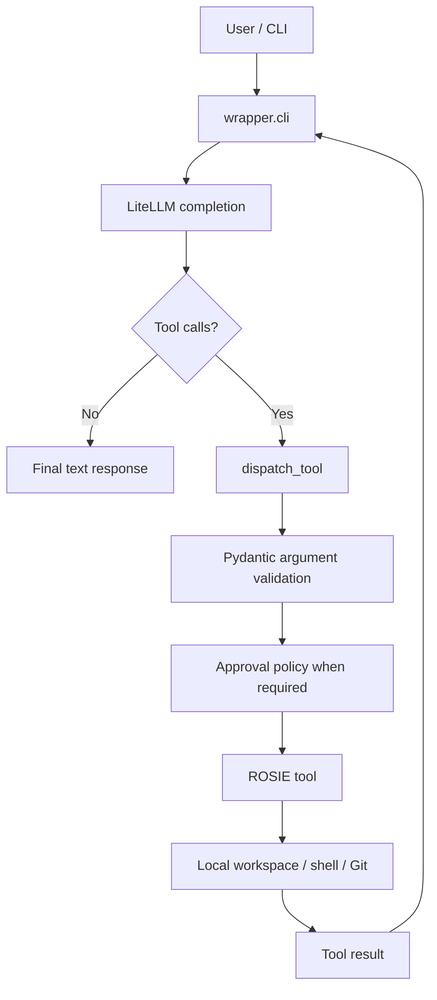

# Architecture

ROSIE is a small local-first agent runtime. The model reasons, ROSIE mediates tool execution, and the workspace is the target environment.

## Execution flow



## Main modules

### `wrapper/cli.py`

Owns the command-line interface and agent loop.

Responsibilities:

- parse CLI arguments;
- establish the workspace root;
- choose approval mode;
- construct the model fallback chain;
- call LiteLLM;
- pass tool schemas to the model;
- execute iterative tool-call resolution;
- preserve conversation and tool-result state during a session;
- stop on a final model response or iteration limit.

The main loop is `_resolve_tool_calls()`.

### `wrapper/tools.py`

Owns the local execution layer.

Responsibilities:

- workspace-root state;
- safe path resolution for file tools;
- Pydantic argument models;
- tool registry;
- OpenAI-format tool schemas;
- tool dispatch;
- file inspection;
- write previews;
- file writes;
- Git status inspection;
- shell execution.

### `wrapper/policy.py`

Owns mutating-action approval behavior.

It defines the three execution modes:

- `ask`
- `auto-write`
- `yolo`

Approval is enforced inside the mutating tools rather than only at the CLI boundary.

## Agent loop

For each user turn:

1. The user message is appended to the `messages` list.
2. `_resolve_tool_calls()` calls `_completion()`.
3. `_completion()` calls `litellm.completion()` with the conversation and `TOOL_SCHEMAS`.
4. If the model returns no tool calls, the returned content becomes the final response.
5. If the model returns tool calls, ROSIE records the assistant tool-call message.
6. Each tool call is JSON-decoded and passed to `dispatch_tool()`.
7. `dispatch_tool()` validates arguments with the associated Pydantic model.
8. The selected tool executes.
9. The textual tool result is appended to the conversation with its tool-call ID.
10. The model receives the updated conversation and can select another action.
11. The cycle repeats until completion or `max_iterations` is exhausted.

The default iteration cap is 20.

## Model boundary

ROSIE does not directly implement individual model APIs. LiteLLM is the provider abstraction.

Current default:

```text
ollama/qwen2.5-coder:7b
```

Current fallback models:

```text
openrouter/deepseek/deepseek-chat
ollama/qwen2.5-coder:7b
```

The agent loop itself is provider-independent as long as the selected model/provider supports the tool-calling format used by LiteLLM.

## Tool boundary

`TOOL_REGISTRY` maps tool names to executable Python functions.

`TOOL_MODELS` maps tool names to Pydantic request models.

`TOOL_SCHEMAS` is generated from those definitions and passed to LiteLLM in OpenAI-compatible function-tool format.

This keeps model-visible schemas and executable functions tied to a single registry/validation boundary.

## Workspace boundary

The explicit file tools resolve paths against a configured workspace root and reject resolved paths outside that root.

This applies to:

- `inspect_file`
- `preview_write_file`
- `write_file`

`inspect_git_status` operates in the workspace root.

`run_shell` starts in the workspace root but is not a filesystem sandbox. Shell commands can reference paths outside the workspace if the operating system permits it. See [SECURITY.md](SECURITY.md).

## Approval boundary

Mutating operations enforce policy at execution time:

- `write_file` checks approval before writing;
- `run_shell` checks approval before executing.

This means callers that use ROSIE's registered tool functions still pass through the existing approval layer when a policy has been installed.

## State

ROSIE currently keeps session state in process memory:

- conversation messages;
- current approval mode;
- workspace root;
- active model chain.

There is currently no database, remote state store, queue, or cloud runtime in the core repository.

## Current external integration seam

The principal integration points are:

- `_completion()` — model invocation boundary;
- `_resolve_tool_calls()` — agent orchestration loop;
- `TOOL_SCHEMAS` — model-visible tool contract;
- `TOOL_REGISTRY` / `dispatch_tool()` — execution contract;
- `ApprovalPolicy` — human authorization boundary.

These seams allow an external agent framework to be added without automatically requiring replacement of the underlying local tools or approval implementation.
