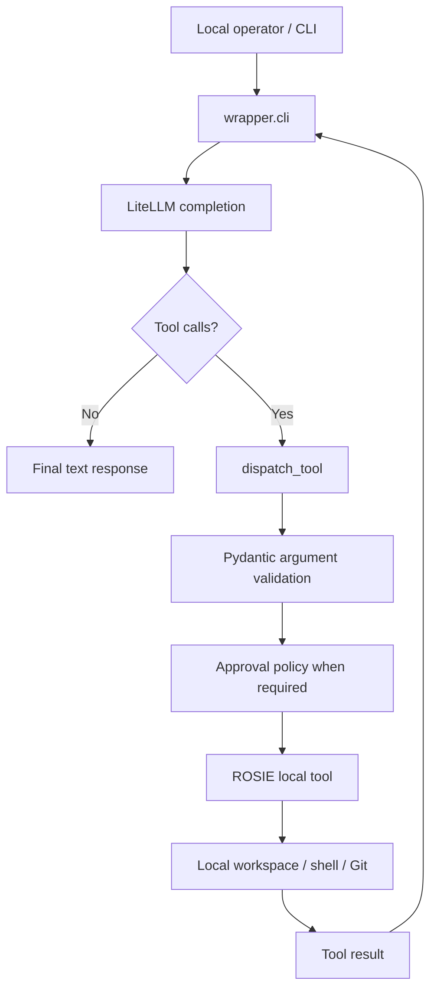

# Architecture

ROSIE is the local-machine bridge/runtime in the HACKASS software-construction stack.

Its architectural responsibility is locality: translate authorized engineering work into operations on the machine where the project, repository, shell, and tools actually live.

## Product architecture

```text
Human
  ↓
HACKASS
  human intent / conversation / product decisions
  ↓
ARCHESTRATOR
  engineering plan / work / execution state / verification
  ↓
ROSIE
  local-machine translation / authority boundary / controlled action
  ↓
Local machine
  files / Git / shell / tools / runtime
```

These responsibilities are intentionally separate.

### HACKASS

HACKASS is the user-facing program.

The user communicates with HACKASS in ordinary language. HACKASS carries product intent and material user decisions into the engineering stack.

### ARCHESTRATOR

ARCHESTRATOR is the engineering engine.

It manages the structured engineering process around approved intent: plans, work, execution state, verification, persistence, continuation, and the record of what actually happened.

### ROSIE

ROSIE is the local-machine bridge/runtime.

It does not decide what product the user wants and does not replace ARCHESTRATOR's engineering lifecycle. It provides the controlled path from authorized engineering work to machine operations.

## Current implementation boundary

The current repository contains a standalone local ROSIE runtime plus the Google hackathon integration used to demonstrate HACKASS.

The standalone runtime can itself call a model and iterate through tools. That is a useful operating and development mode, but it does not redefine the product boundary: in the broader architecture, ROSIE's durable responsibility is the local side of execution.

## Standalone local execution flow



This flow is the current standalone implementation of ROSIE's local action surface.

## Main local modules

### `wrapper/cli.py`

Owns the standalone CLI and local iterative loop.

Responsibilities include:

- parsing CLI arguments;
- establishing the workspace root;
- choosing approval mode;
- constructing the standalone model chain;
- passing local tool schemas to the model;
- resolving iterative tool calls;
- preserving conversation and tool-result state during a session; and
- stopping on a final response or iteration limit.

### `wrapper/tools.py`

Owns the local action layer.

Responsibilities include:

- workspace-root state;
- safe path resolution for bounded file tools;
- Pydantic argument models;
- tool registry and dispatch;
- directory and workspace search;
- file inspection;
- write previews;
- file writes;
- targeted patches;
- Git status / diff / log inspection; and
- shell execution.

### `wrapper/policy.py`

Owns mutating-action approval behavior for the local side.

Modes:

- `ask`
- `auto-write`
- `yolo`

Approval is enforced close to the mutating local action rather than relying only on model instructions.

### `wrapper/system_prompt.py`

Provides the compact standalone ROSIE operating prompt. It tells the local model to inspect before modifying, prefer native/read-only inspection tools, never invent results, and only claim verified work.

### PEEP integration

The standalone runtime can attach PEEP as the shell observation path. If PEEP is unavailable, ROSIE reports the fallback and continues with the subprocess executor.

PEEP is observation around execution; it does not replace ROSIE's locality role or ARCHESTRATOR's engineering responsibility.

### Task telemetry and RATTER

Every standalone turn (`wrapper/cli.py:_run_turn`) is assigned a unique `task_id` (`task_<uuid>`) recorded in a lightweight runtime context (`wrapper/rt_context.py`). That id is telemetry plumbing only — it is never exposed to the model as a tool argument. All of a turn's shell commands, PEEP sessions, and RATTER telemetry events share the id, so a downstream observer can correlate a single user request with every machine action it caused.

PEEP events are forwarded to RATTER through an asynchronous sink (`wrapper/ratter_async.py`). A bounded queue accepts events from the execution thread and a background worker posts batches to RATTER, so the HTTP telemetry round trip never sits on the command-execution path. Enqueue is non-blocking, the queue is bounded, and any RATTER failure is non-fatal: telemetry dropping never breaks command execution.

Shell results carry two hardening properties shared by both the PEEP and the subprocess executors:

- an explicit `TIMED_OUT: true|false` marker on every result, with an explicit timeout error message — a timeout is never inferred from an ambiguous exit code;
- bounded output (head + tail, with an explicit truncation marker) so a model never receives an unbounded result payload.

## Local tool boundary

The current local tool registry exposes bounded workspace discovery and file operations (including `move_path` and `delete_path`), Git inspection, and shell execution.

`TOOL_REGISTRY` maps tool names to executable Python functions.

`TOOL_MODELS` maps tool names to Pydantic request models.

`TOOL_SCHEMAS` provides the model-visible tool contracts.

`dispatch_tool()` is the central execution entry point.

## Workspace boundary

Explicit file and workspace tools resolve paths against a configured workspace root and reject traversal outside it.

This applies to bounded operations such as:

- directory listing and search;
- file inspection;
- write previews;
- file writes;
- targeted patches; and
- path-filtered Git inspection.

Shell execution is different: the workspace is its starting directory, not an OS-level sandbox. A command may access anything permitted to the operating-system identity running ROSIE.

See [SECURITY.md](SECURITY.md).

## Approval boundary

Mutating local operations enforce the active policy at execution time.

That boundary matters because ROSIE is the layer where requested engineering work crosses into actual machine authority.

See [APPROVAL_MODES.md](APPROVAL_MODES.md).

## Standalone model boundary

The standalone CLI currently uses LiteLLM as a provider abstraction.

That is an implementation detail of standalone ROSIE operation, not a requirement that ROSIE own reasoning in the complete HACKASS stack.

In the hackathon path, Google ADK and Gemini provide the reasoning/framework path while local actions are delegated into the incorporated execution surface.

## State

The current standalone ROSIE runtime keeps local session state in process memory, including:

- conversation messages;
- current approval mode;
- workspace root; and
- active standalone model chain.

The local core does not currently require a database, queue, or remote state store.

## Integration seams

Important local integration points include:

- local model invocation in standalone mode;
- the iterative tool resolution loop;
- model-visible tool schemas;
- tool registry / dispatch;
- approval policy; and
- the workspace boundary.

These seams allow higher-level systems to use ROSIE's local action surface without requiring ROSIE to become the higher-level product or engineering engine.

# HACKASS hackathon integration

The repository also contains hackathon-created code that integrates Google ADK and Gemini with the incorporated ARCHESTRATOR/local execution foundation.

## Hackathon-facing execution chain

The current deployed path is:

```text
Browser / HACKASS interface
  ↓
Firebase Hosting
  ↓
Cloud Run
  ↓
server.py / POST /execute
  ↓
HACKASS run_hackass()
  ↓
Google ADK
  ↓
Gemini 3.7 Flash / Vertex AI
  ↓
HACKASS bridge
  ↓
incorporated ARCHESTRATOR tool layer
  ↓
workspace available to the deployed runtime
  ↓
result returned to HACKASS/browser
```

This path demonstrates HACKASS, Google ADK, Gemini, and real tool execution.

It should not be confused with a completed web-to-an-external-user-machine transport.

## Locality distinction

A Cloud Run container has a local filesystem of its own. Executing tools inside that container proves real execution in the deployed runtime, but it does not prove that the cloud application can directly operate a separate user's laptop or desktop.

ROSIE's product architecture fills that locality boundary:

```text
Web-side HACKASS / ARCHESTRATOR
  ↓
verified ROSIE connection
  ↓
ROSIE process on user's machine
  ↓
user's authorized local workspace and tools
```

That web-to-user-machine path must only be described as live once the ROSIE connection/transport is actually implemented, attached, and verified.

Until then, the hackathon deployment should be described factually as operating on the workspace available to its deployed runtime.

## Provenance boundary

For the Google All Things Agentic submission:

- **HACKASS** — newly created hackathon user-facing project/integration.
- **ARCHESTRATOR** — pre-existing engineering/execution software incorporated into the submission and disclosed.
- **ROSIE** — local-machine bridge/runtime product role represented by the local execution surface in this repository.

The hackathon repository temporarily colocates implementation from these responsibilities. Colocation does not make the responsibilities identical.

## Hackathon-created Google integration

The `hackass/` package contains the hackathon-specific Google path:

- `hackass/config.py` — Gemini / Vertex configuration;
- `hackass/agent.py` — Google ADK agent factory and runner;
- `hackass/bridge.py` — ADK-to-existing-tool adapter;
- `hackass/run.py` — hackathon CLI entry point.

The bridge delegates actions into the existing tool dispatch layer rather than duplicating the file, Git, shell, and approval behavior.

## Google Cloud deployment

Current hackathon deployment:

| Field | Value |
|---|---|
| Service | `rosie-api` |
| Cloud Run region | `us-central1` |
| Google Cloud project | `rosie-fire` |
| Gemini model | `gemini-3.7-flash` |
| Vertex location | `global` |
| Hosting | Firebase Hosting |
| Container registry | Artifact Registry |

Firebase Hosting serves the static browser surface and proxies `/health` and `/execute` to Cloud Run.

The Google deployment is a hackathon infrastructure choice. ROSIE's local-machine role is not conceptually tied to Google Cloud.

## Architectural rule of thumb

When describing the system, use the responsibility chain rather than the repository layout:

```text
HACKASS      = the human talks here
ARCHESTRATOR = engineering is managed here
ROSIE        = authorized work reaches the local machine here
```
