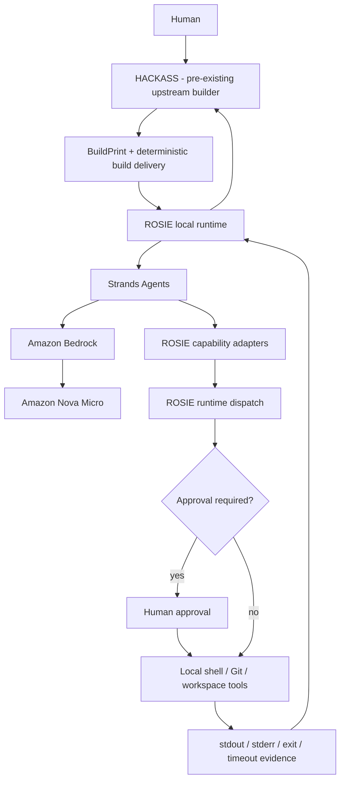

# ROSIE Architecture

ROSIE is the local-machine runtime and authority boundary for agentic software work.

Its job is locality: bind an agent to the selected local workspace, expose bounded machine capabilities, preserve approval policy, and return truthful execution evidence.

## Submission architecture



## Responsibility boundaries

### HACKASS

HACKASS is a pre-existing upstream software-construction system. In the hackathon demonstration it produces the build, BuildPrint metadata, and delivery event consumed by ROSIE.

HACKASS is disclosed as pre-existing work.

### ROSIE

ROSIE owns local-machine authority and workspace identity.

ROSIE is responsible for:

- the selected local workspace;
- runtime/session ownership;
- local tool contracts;
- approval enforcement;
- shell execution;
- local Git/workspace inspection;
- timeout/output bounds; and
- truthful local execution results.

### Strands Agents

Strands provides the agent loop used for local post-delivery verification.

Strands receives ROSIE-owned capabilities. It does not bypass ROSIE with direct machine access.

### Amazon Bedrock / Nova Micro

The verified live submission path uses:

```text
us.amazon.nova-micro-v1:0
```

through Amazon Bedrock.

## Runtime ownership

A `RuntimeSession` binds execution to the selected workspace and owns the runtime-specific execution dependencies used by ROSIE.

The important invariant is:

```text
delivery workspace == ROSIE RuntimeSession workspace == Strands execution workspace
```

The submission path does not create a second project directory for verification.

## Capability bridge

`wrapper/strands_bridge.py` exposes ROSIE capabilities to Strands as agent tools.

Examples include:

- `rosie_inspect_git_status`
- `rosie_run_shell`

Tool execution routes back through ROSIE runtime dispatch, preserving ROSIE's policy and executor ownership.

## Approval boundary

ROSIE supports local approval modes including `ask`, `auto-write`, and `yolo`.

The hackathon proof uses `auto-write`:

```text
file writes        → automatically approved
shell execution    → explicit human approval required
```

Approval is enforced at the execution boundary. It is not merely a prompt instruction to the model.

## Post-delivery verification

`wrapper/strands_verify.py` runs two independent verification turns when the build declares a test command.

### Proof-program check

The Strands agent locates and actually executes the delivered proof program through `rosie_run_shell`.

The returned result must come from the execution itself, not from merely locating or listing the file.

### Declared-test-command check

The BuildPrint's declared test command is carried as build metadata and executed after delivery through Strands and ROSIE.

Example:

```text
python -m pytest
```

The agent may locate the real project root before running the declared command, but it must execute that command rather than substitute a different verification.

## Artifact identity

The Strands verification layer is intentionally post-delivery.

The frozen build/manifest determines what bytes were delivered. The declared test command is metadata and does not alter the manifest hash.

```text
frozen delivered bytes
        ↓
materialize locally
        ↓
Strands/ROSIE execute and verify
```

Strands is not allowed to rewrite the delivered program as part of verification.

## Truthful result model

Each check returns execution evidence including:

- status;
- command/tool execution detail;
- stdout;
- stderr;
- exit code; and
- timeout truth where applicable.

Independent checks are merged without hiding failure. A delivery can remain successfully delivered even if post-delivery verification fails.

## Bounded execution

Agent turns use bounded watchdog behavior, while ROSIE's shell executor owns the in-flight command timeout ceiling.

This preserves two separate bounds:

- the agent turn cannot run forever; and
- a shell command cannot run forever.

Timeouts are reported as execution truth rather than converted into a fabricated success.

## Local tool layer

The broader ROSIE runtime exposes bounded capabilities for:

- directory/workspace search;
- file inspection;
- write preview and file mutation;
- moving and deleting paths;
- Git status/diff/log inspection; and
- shell execution.

File/path tools enforce the configured workspace boundary. Shell execution begins in the bound workspace, but the shell remains real host authority: ROSIE cannot remove permissions already granted to the operating-system user.

See [SECURITY.md](SECURITY.md) for the precise boundary.

## Standalone ROSIE mode

ROSIE can also operate as a standalone local agent through its CLI and LiteLLM provider abstraction.

That mode is useful for development and direct local use, but it is separate from the Agents for Humans submission path.

```text
standalone operator
→ LiteLLM/model
→ ROSIE tools
→ local machine
```

The hackathon path is:

```text
HACKASS delivery
→ ROSIE
→ Strands Agents
→ Bedrock / Nova Micro
→ ROSIE tools
→ local machine
```

## Legacy repository assets

The repository contains older Google hackathon code and documentation from earlier development. Those assets are not the technology path submitted for Agents for Humans.

The current submission is the ROSIE + Strands + Amazon Bedrock/Nova local execution and verification path documented here.
